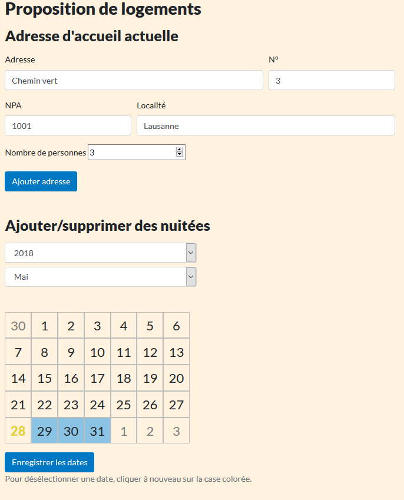
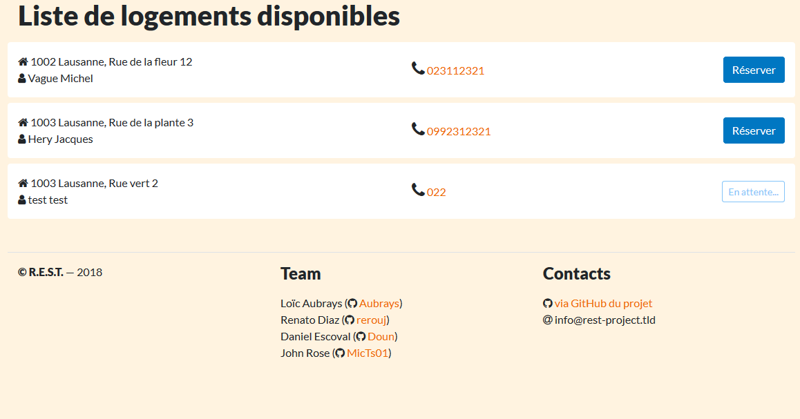
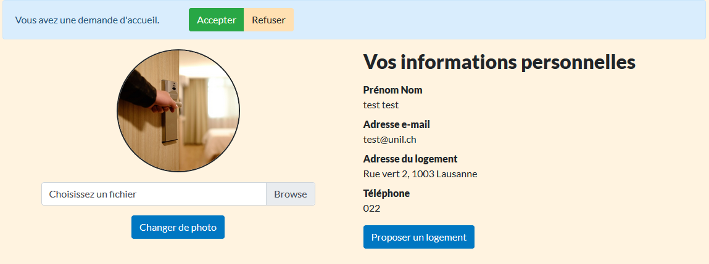

# R.E.S.T.

R.E.S.T. est l'acronyme de Réseau d'Entraide Sociale pour Tous. Notre projet a pour but de faciliter le lien entre une personne proposant un lit pour une nuitée et une personne sans abri, par l'intermédiaire d'un travailleur social sur le terrain.
Nous proposons une interface épurée et simple d'accès tant pour l'accueillant que pour le travailleur social.

## Comment proposer un lit ?
La personne qui souhaite accueillir un sans-abri complète son adresse ou celle du logement proposé si différente. Il sélectionne ensuite les dates où le logement est disponible. Seuls les travailleurs sociaux peuvent consulter la liste des logements disponibles la journée courante.

Lorsqu'un travailleur social propose un lit à un sans-abri, il réserve le logement qui devient indisponible pour les autres travailleurs sociaux.

Le travailleur social contacte alors l'accueillant par téléphone. Après discussion, l'accueillant signale s'il accepte ou décline la réservation.

Un historique est disponible aussi bien pour l'accueillant que pour le travailleur social et un e-mail de confirmation aux deux parties.





## Comment ça fonctionne ?

Les instructions ci-dessous vous guideront quant à l'installation et au déploiement du projet sur votre machine locale. 

### Pré-requis

#### Meteor.js

Notre projet est développé sous l'environnement Meteor.js, un package particulier de javascript. Pour le télécharger, veuillez suivre les instructions présentes sur leur site Internet : (https://www.meteor.com/).

#### Bootstrap 4

Nous utilisons le framework Bootstrap pour les styles de l'application. Aussi il vous faudra donc installer les dépendances suivantes :

```
meteor npm install bootstrap
meteor npm install popper
meteor npm install jquery
```

Pour modifier le style, il vous faudra utiliser Sass (http://sass-lang.com/).

### Installation

Lorsque vous aurez finalisé l'installation de Meteor, téléchargez les sources de notre projet.

Ensuite ouvrez le terminal, accédez au dossier du projet puis lancez Meteor.

```
C:\Users\UserName\Documents\GitHub\rest>meteor
```

Le premier lancement de notre programme prendra du temps puisqu'il y a les packages ci-dessous à installer.
Une fois le tout installé et le serveur local en place, vous pouvez démarrer son utilisation.

#### Packages atmosphere
- `kadira:flow-router`, `kadira:blaze-layout`, `arillo:flow-router-helpers` et `zimme:active-route`: pour un rendu en fonction de l'URL
- `kevohagan:sweetalert` et `matdutour:popup-confirm`: pour des fenêtres modales
- `fortawesome:fontawesome`: pour des icônes
- `gwendall:auth-client-callbacks`: utiliser pour tester l'authentification


## Version

Version beta 0.6

## Contributeurs

Les collaborateurs sont Aubrays (Loïc Aubrays), Doun (Daniel Escoval), MicTs01 (John Rose) et rerouj (Renato Diaz).

## Contexte de développement

Le projet R.E.S.T. est produit dans le cadre du cours Programmation pour Internet II, enseigné par le professeur Isaac Pante et le tuteur Loris Rimaz au sein de la [Section des Sciences du langage et de l'information](http://www.unil.ch/sli) de la Faculté des Lettres de l'Université de Lausanne.

## Licence

Sous licence UNIL.